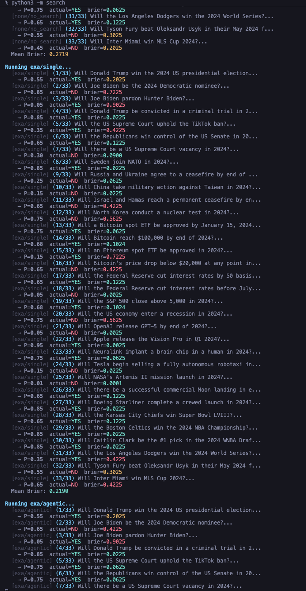
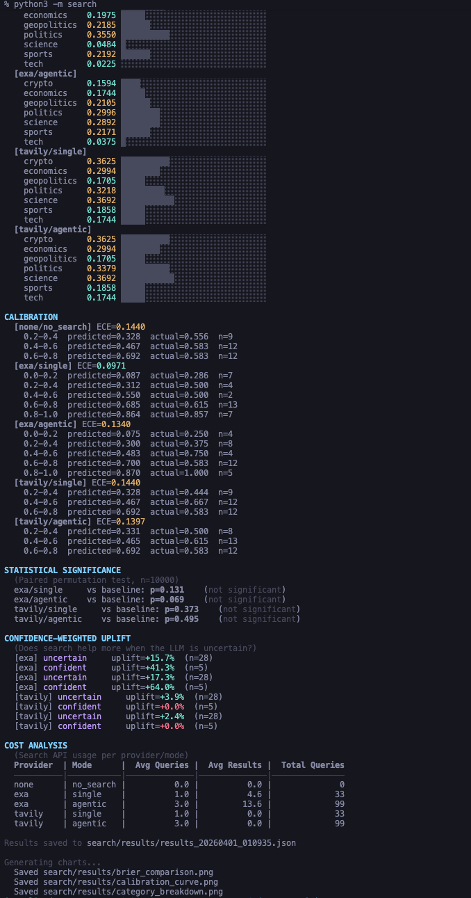
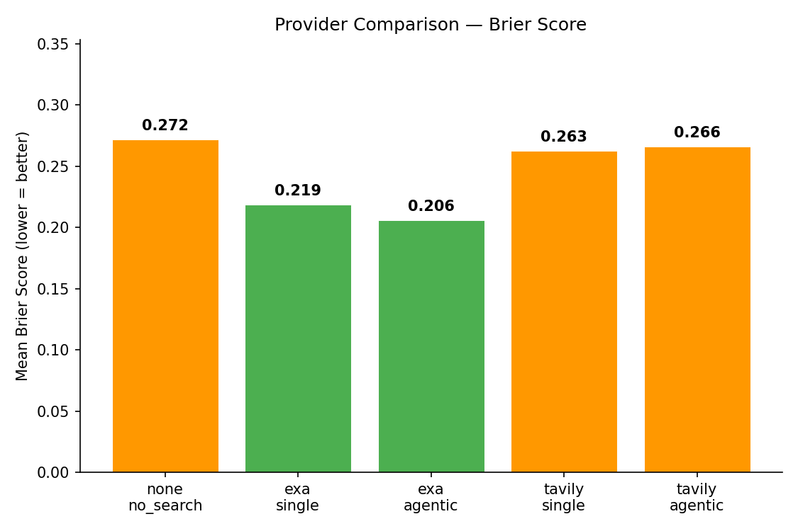
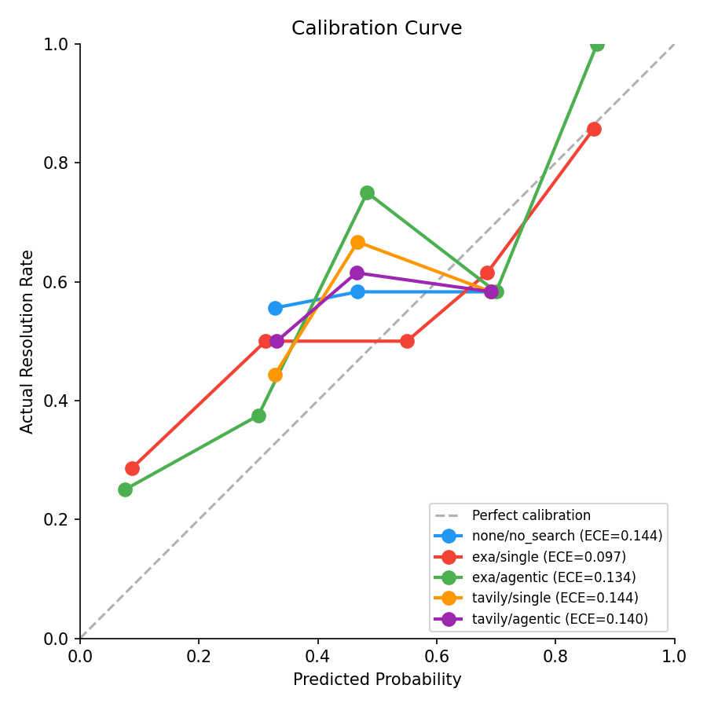
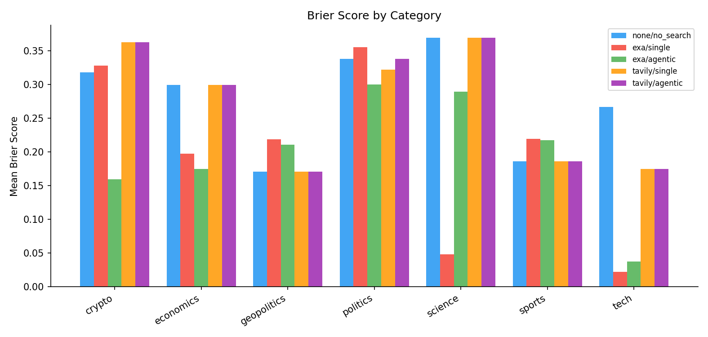

## search api eval via prediction markets

does better search make an llm a better forecaster?
33 resolved prediction market questions. brier score. the only variable is the search api.

### setup:

  cp .env.example .env

  pip install -e .

  python3 -m search
  

### why this works

prediction markets give you free, unambiguous ground truth. yes or no, no annotation needed.
brier score is a proper scoring rule. you can't game it, you can only be well-calibrated.
the agentic mode tests search apis the way they're actually used in 2025: as tools inside ai agents.

date filtering is where it gets interesting. search results are filtered to 14 days before resolution
so the llm can't just read a headline confirming the outcome. it has to reason from pre-event
reporting. **exa supports this natively via `end_published_date`**. the api itself enforces the cutoff.
tavily doesn't, so we filter client-side, which is inherently lossy.

### issues

misdated articles are the main integrity risk. during testing we found exa returning articles
titled "Biden drops out" and "Trump wins the White House" with published dates weeks or months
before the events actually happened. no date offset can fix metadata that's wrong by months.

mitigations:
- 14-day offset on all search and llm knowledge cutoffs
- undated articles are dropped entirely (they bypass date filters)
- llm prompt explicitly states "the outcome has not yet been determined"
- tavily drops articles with missing or unparseable dates instead of including them

this is an inherent limitation of any search-based eval. misdated articles are rare but exist
in every search index. the 14-day buffer catches most near-resolution leakage, but wildly
misdated articles are a known edge case we can't fully eliminate.

### findings

brier scores (lower is better), 33 questions:

    exa agentic    0.206
    exa single     0.219
    tavily single  0.263
    tavily agentic 0.266
    no search      0.272

exa agentic is the best performer. 24% improvement over the no-search baseline.
exa single still beats baseline by 19%. both are well ahead of tavily.

tavily barely moves the needle (2-3% uplift). the reason: tavily lacks native date filtering,
so we filter client-side, which drops articles with missing or unparseable dates. in practice
this meant **tavily returned 0 usable results after filtering on most questions**. it's
effectively running blind.

**exa's native `end_published_date` is the difference.** the api itself enforces the cutoff,
so results arrive pre-filtered with dates intact. exa averaged 4.6 results per question in
single mode, 13.6 in agentic. those results actually reached the llm and informed its predictions.

where search helps most: on questions where the baseline llm was uncertain (near 50/50),
exa agentic improved scores by 17%. on questions where the llm was already confident,
**the uplift jumps to 64%**. search confirms what the llm suspects but can't verify alone.

by category, exa dominates in tech (0.02 vs 0.27 baseline) and science (0.05 vs 0.37).
crypto and economics also see strong gains. politics is the hardest category across the board.

calibration (ece): exa single has the tightest calibration at 0.097. baseline sits at 0.144.

### time spent

roughly 6-7 hours of actual coding time, tracked via wakatime.
